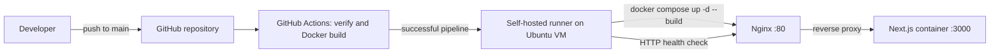

# Nexora DevOps Project

Nexora is a Next.js SaaS landing page. This repository adds a reproducible Docker deployment and a CI/CD pipeline to deploy it automatically to an Ubuntu test VM.

## Architecture



The browser connects to Nginx at `http://localhost`. Nginx forwards the request through the internal Docker network to Nexora on port `3000`. No backend or database is needed for this frontend-only application.

## Run locally without Docker

Prerequisite: Node.js 20 or later.

```bash
npm ci
npm run dev
```

Open [http://localhost:3000](http://localhost:3000).

## Docker and Docker Compose

Prerequisite: Docker Engine with Docker Compose v2.

Start the full local stack:

```bash
docker compose -p nexora up -d --build
```

Open [http://localhost](http://localhost). Nginx listens on port `80`; Nexora's port `3000` is private to the Compose network.

Useful commands:

```bash
docker compose -p nexora ps
docker compose -p nexora logs -f
docker compose -p nexora down
```

## CI/CD pipeline

The workflow is [`.github/workflows/ci-cd.yml`](.github/workflows/ci-cd.yml). Every push runs these stages in order:

1. **Verify application build**: `npm ci` and `npm run build` run on a GitHub-hosted runner.
2. **Build Docker image**: the Dockerfile is built on a GitHub-hosted runner.
3. **Deploy to Ubuntu test VM**: only a successful push to `main` is assigned to the VM's self-hosted runner. It checks out the commit, runs Docker Compose, and verifies `http://localhost`.

The VM runner is installed as a system service, so it automatically reconnects after the VM reboots. Docker Hub is not required in this source-based test deployment: the VM builds the checked-out commit locally.

## Operations, security, and rollback

See [the operations guide](docs/operations.md) for diagnostics, runner management, basic security practices, and rollback.
